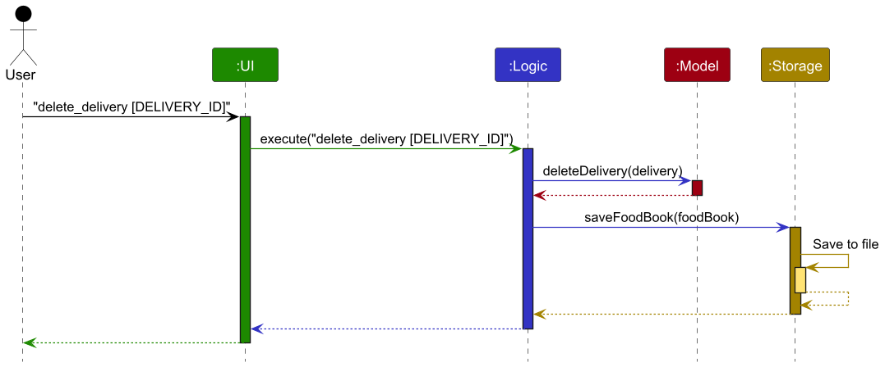
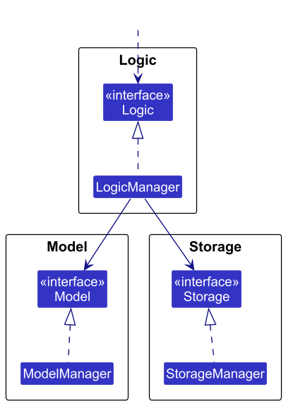
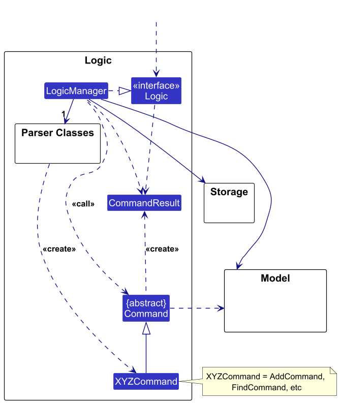
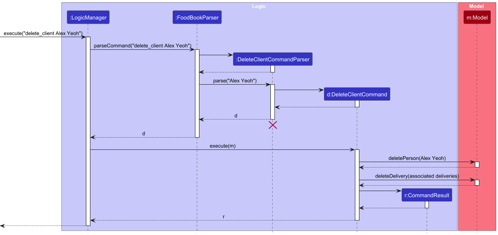
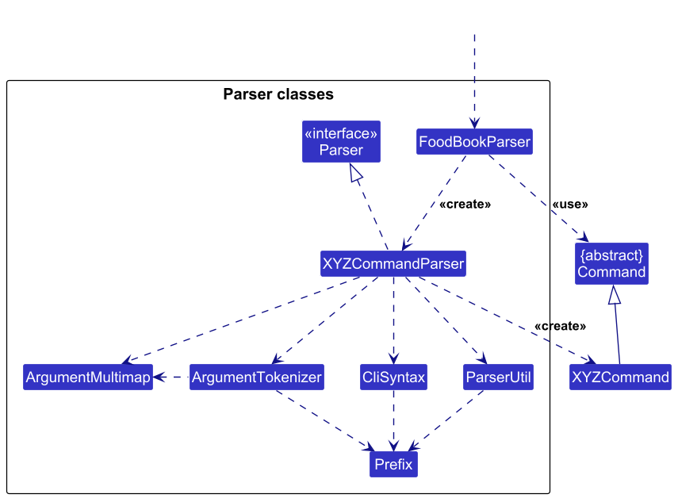
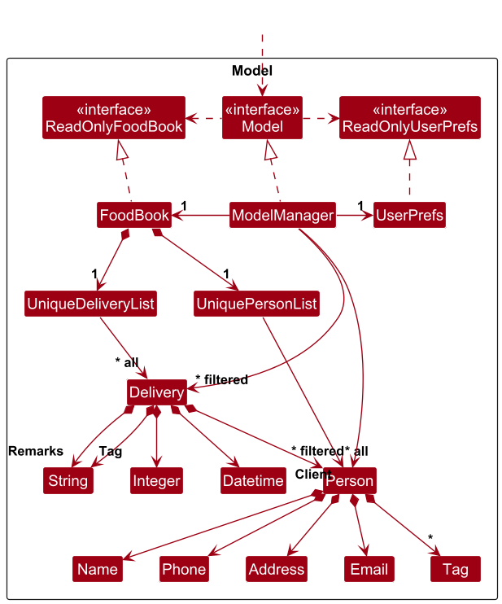
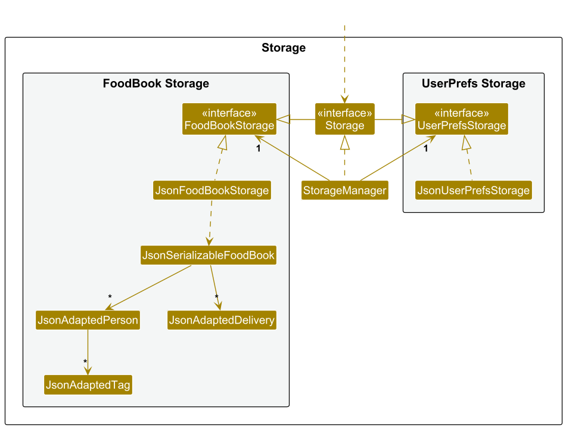
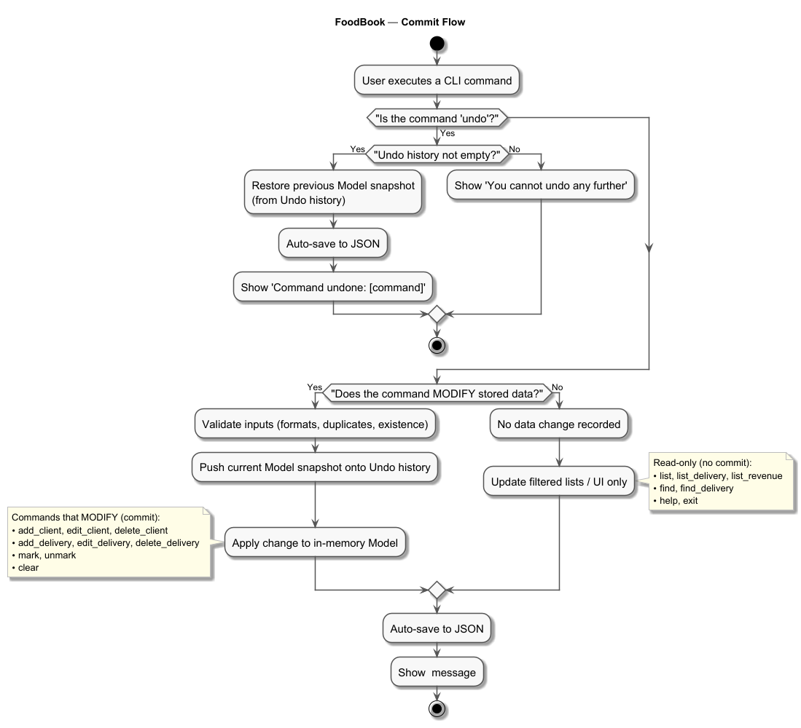

# FoodBook Developer Guide

## **Acknowledements**

This project is based on the AddressBook-Level3 project created by the [SE-EDU initiative](https://se-education.org).

## 1. Setting up & Getting Started

Refer to the guide [here](./SettingUp.md).

## 2. Design

### Architecture


The ***Architecture Diagram*** given above explains the high-level design of the App.

Given below is a quick overview of main components and how they interact with each other.

**Main components of the architecture**

**`Main`** (consisting of classes [`Main`](https://github.com/AY2526S1-CS2103T-F14a-1/tp/blob/master/src/main/java/seedu/foodbook/Main.java) and [`MainApp`](https://github.com/AY2526S1-CS2103T-F14a-1/tp/blob/master/src/main/java/seedu/foodbook/MainApp.java) is in charge of the app launch and shut down.
* At app launch, it initializes the other components in the correct sequence, and connects them up with each other.
* At shut down, it shuts down the other components and invokes cleanup methods where necessary.

The bulk of the app's work is done by the following four components:

* [**`UI`**](#ui-component): The UI of the App.
* [**`Logic`**](#logic-component): The command executor.
* [**`Model`**](#model-component): Holds the data of the App in memory.
* [**`Storage`**](#storage-component): Reads data from, and writes data to, the hard disk.

[**`Commons`**](#common-classes) represents a collection of classes used by multiple other components.

**How the architecture components interact with each other**

The *Sequence Diagram* below shows how the components interact with each other for the scenario where the user issues the command `delete_delivery`.



Each of the four main components (also shown in the diagram above),

* defines its *API* in an `interface` with the same name as the Component.
* implements its functionality using a concrete `{Component Name}Manager` class (which follows the corresponding API `interface` mentioned in the previous point.

For example, the `Logic` component defines its API in the `Logic.java` interface and implements its functionality using the `LogicManager.java` class which follows the `Logic` interface. Other components interact with a given component through its interface rather than the concrete class (reason: to prevent outside component's being coupled to the implementation of a component), as illustrated in the (partial) class diagram below.



The sections below give more details of each component.

### UI component

The **API** of this component is specified in [`Ui.java`](https://github.com/AY2526S1-CS2103T-F14a-1/tp/blob/master/src/main/java/seedu/foodbook/ui/Ui.java)


The UI consists of a `MainWindow` that is made up of parts e.g.`CommandBox`, `ResultDisplay`, `PersonListPanel`, `DeliveryListPanel`, `StatusBarFooter` etc. All these, including the `MainWindow`, inherit from the abstract `UiPart` class which captures the commonalities between classes that represent parts of the visible GUI.

The `UI` component uses the JavaFx UI framework. The layout of these UI parts are defined in matching `.fxml` files that are in the `src/main/resources/view` folder. For example, the layout of the [`MainWindow`](https://github.com/se-edu/addressbook-level3/tree/master/src/main/java/seedu/address/ui/MainWindow.java) is specified in [`MainWindow.fxml`](https://github.com/se-edu/addressbook-level3/tree/master/src/main/resources/view/MainWindow.fxml)

The `UI` component,

* executes user commands using the `Logic` component.
* listens for changes to `Model` data so that the UI can be updated with the modified data.
* keeps a reference to the `Logic` component, because the `UI` relies on the `Logic` to execute commands.
* depends on some classes in the `Model` component, as it displays `Person` object residing in the `Model`.

### Logic component

The **API** of this component is specified in [`Logic.java`](https://github.com/AY2526S1-CS2103T-F14a-1/tp/blob/master/src/main/java/seedu/foodbook/logic/Logic.java)

Here's a (partial) class diagram of the `Logic` component:



The sequence diagram below illustrates the interactions within the `Logic` component, taking `execute("delete_client Alex Yeoh")` API call as an example.



 **Note:** The lifeline for `DeleteCommandParser` should end at the destroy marker (X) but due to a limitation of PlantUML, the lifeline continues till the end of diagram.

How the `Logic` component works:

1. When `Logic` is called upon to execute a command, it is passed to an `FoodBookParser` object which in turn creates a parser that matches the command (e.g., `DeleteClientCommandParser`) and uses it to parse the command.
1. This results in a `Command` object (more precisely, an object of one of its subclasses e.g., `DeleteClientCommand`) which is executed by the `LogicManager`.
1. The command can communicate with the `Model` when it is executed (e.g. to delete a person and associated deliveries).<br>
   Note that in the code this can take several interactions (between the command object and the `Model`) to achieve.
1. The result of the command execution is encapsulated as a `CommandResult` object which is returned back from `Logic`.

Here are the other classes in `Logic` (omitted from the class diagram above) that are used for parsing a user command:



How the parsing works:
* When called upon to parse a user command, the `FoodBookParser` class creates an `XYZCommandParser` (`XYZ` is a placeholder for the specific command name e.g., `AddClientCommandParser`) which uses the other classes shown above to parse the user command and create a `XYZCommand` object (e.g., `AddClientCommand`) which the `FoodBookParser` returns back as a `Command` object.
* All `XYZCommandParser` classes (e.g., `AddClientCommandParser`, `DeleteDeliveryCommandParser`, ...) inherit from the `Parser` interface so that they can be treated similarly where possible e.g, during testing.

### Model component
The **API** of this component is specified in [`Model.java`](https://github.com/AY2526S1-CS2103T-F14a-1/tp/blob/master/src/main/java/seedu/foodbook/model/Model.java)



The `Model` component,

* stores the food book data i.e., all `Person` objects (which are contained in a `UniquePersonList` object) and `Delivery` objects (which are contained in a `UniqueDeliveryList` object).
* stores the currently 'selected' `Person` and `Delivery` objects (e.g., results of a search query) as a separate _filtered_ list which is exposed to outsiders as an unmodifiable `ObservableList<Person>` and `ObservableList<Delivery>` respectively.  These can be 'observed' e.g. the UI can be bound to these lists so that the UI automatically updates when the data in the list change.
* stores a `UserPref` object that represents the user’s preferences. This is exposed to the outside as a `ReadOnlyUserPref` objects.
* does not depend on any of the other three components (as the `Model` represents data entities of the domain, they should make sense on their own without depending on other components)

### Storage component

The **API** of this component is specified in [`Storage.java`](https://github.com/AY2526S1-CS2103T-F14a-1/tp/blob/master/src/main/java/seedu/foodbook/storage/Storage.java)



The `Storage` component,
* can save both food book data and user preference data in JSON format, and read them back into corresponding objects.
* inherits from both `FoodBookStorage` and `UserPrefStorage`, which means it can be treated as either one (if only the functionality of only one is needed).
* depends on some classes in the `Model` component (because the `Storage` component's job is to save/retrieve objects that belong to the `Model`)

### Common classes

Classes used by multiple components are in the `seedu.foodbook.commons` package.

### Full Workflow



The diagram above gives a full overview of the workflow of FoodBook.

--------------------------------------------------------------------------------------------------------------------

## **Documentation, logging, testing, configuration, dev-ops**

* [Documentation guide](./Documentation.md)
* [Testing guide](./Testing.md)
* [Logging guide](./Logging.md)
* [Configuration guide](./Configuration.md)
* [DevOps guide](./DevOps.md)

--------------------------------------------------------------------------------------------------------------------

## **Appendix: Requirements**

### Product scope

*Target user profile**:
- small food business owners in Singapore (e.g., home-based caterers, micro-F&B doing deliveries)

- manage many client addresses and recurring deliveries

- prefer fast CLI workflows over complex GUIs; type quickly; value minimal repetition

- often work solo or with 1 helper; need quick search/edit, duplicate prevention, and simple reporting

- store data locally

**Value proposition**: FoodBook provides a fast, reliable CLI to store, search, and manage clients and deliveries.
Compared to notes/spreadsheets, it reduces admin time via quick add/edit/filter, validation & duplication warnings, status tracking, and simple reporting, improving delivery accuracy and day-to-day efficiency.


### User Stories

**Legend:** High (must have) – ``***``  |  Medium (nice to have) – ``**``  |  Low (later/considered) – ``*``

| Priority | As a …              | I want to …                                                | So that I can …                                                          |
|:------:|----------------------|------------------------------------------------------------|--------------------------------------------------------------------------|
| ``***`` | food business owner  | add a client with name/phone/email/unit/postal             | keep accurate contact/address records                                    |
| ``***`` | food business owner  | edit a client’s details                                    | keep information up-to-date                                              |
| ``***`` | food business owner  | delete a client                                            | remove outdated entries                                                  |
| ``***`` | food business owner  | add a delivery (date/time/remarks/price, linked to client) | schedule jobs and avoid forgetting                                       |
| ``***`` | food business owner  | mark/unmark a delivery as completed                        | see what’s pending vs done                                               |
| ``***`` | food business owner  | edit a delivery                                            | change delivery details dynamically                                      |
| ``***`` | food business owner  | delete a delivery                                          | Remove dud deliveries                                                    |
| ``***`` | food business owner  | search clients by name/phone/email                         | find a client quickly                                                    |
| ``***`` | food business owner  | search deliveries by date, client, status                  | trackk all jobs of a a particular type (e.g. deliveries on the same day) |
| ``**`` | food business owner  | undo a recent change                                       | recover from mistakes                                                    |
| ``**`` | food business owner  | tag deliveries as corporate or personal                    | prioritise important deliveries                                          |
| ``*``  | food business owner  | list revenue by varios criteria                            | analyze business patterns and growth                                     |

*Items marked ``*`` are considered but not required for MVP; keep if time permits.*

### Use Cases

_(For all use cases below, the System is FoodBook and the Actor is the user unless specified otherwise.)_

### UC01 – Add a client

**MSS:**

1. User enters:  
   ```add_client n/NAME p/PHONE e/EMAIL a/ADDRESS```
2. System saves the client.
4. System confirms success.  
   **Use case ends.**

**Extensions**

- **2a. Any field invalid**  
  → 2a1. System shows specific error (e.g., “Phone numbers should only contain numbers, and it should be at least 3 digits long.”)  
  → Use case resumes at **Step 1**.

- **2a. Duplicate Client found**  
  → 3a1. System warns “This person already exists in the food book”  
  → 3a2. User cancels or proceeds with a different name/phone.  
  → Use case resumes at **Step 1**.

### UC02 – Edit a client

**Precondition:** Client exists.

**MSS**

1. User searches the client:
   ```find_client n/Alice```
2. System shows matching clients.
3. User enters:  
   ```edit_client Alice Tan /p 98765432```
4. System validates new fields and updates the client.
5. System confirms success.  
   **Use case ends.**

**Extensions**

- **2a. No matching client**  
  → System shows “Client not found.” **Use case ends.**

### UC03 – Add a delivery for a client

**Precondition:** Target client exists.

**MSS**

1. User confirms client (e.g., ```find_client /n Alice```)
   and notes the exact name.
2. User enters:  
   ```add_delivery n/Alice Tan d/20/09/2025 t/1300 r/3x Bento c/7```
3. System creates delivery with a unique ID.
5. System confirms success and displays the new delivery ID.  
   **Use case ends.**

**Extensions**

- **2a. Client does not exist**  
  → System shows “Client does not exist.” **Use case ends.**

- **3a. Date in the past / invalid time / invalid price**  
  → System shows specific error and does not create the delivery.  
  → Use case resumes at **Step 2**.

### UC04 – View and mark deliveries for a day

**MSS**

1. User enters:  
   ```find_delivery d/20/12/2025```
2. System lists all deliveries on that date with IDs and status.
3. User enters to mark a delivery completed:
   ```mark 67```
4. System updates status and confirms.  
   **Use case ends.**

**Extensions**

- **1a. Invalid date format**  
  → System shows “Invalid date provided.” **Use case ends.**

- **2a. No deliveries found**  
  → System shows “No deliveries found.” **Use case ends.**

- **3a. Delivery ID not found**  
  → System shows “Delivery does not exist.” **Use case ends.**

### UC05 – Undo last change

**MSS**

1. A change has been made earlier (e.g. user marked a delivery completed):
   `mark 67`
2. User enters:
   `undo`
3. System reverts the last change (e.g. delivery 67 set back to “pending”) and confirms.  
   **Use case ends.**

**Extensions**

* **2a. Nothing to undo or Undo history limit reached**
  → System shows “Nothing to undo.” **Use case ends.**

### UC06 – List revenue for a period

**MSS**

1. User enters either a range query: `list_revenue sd/01/12/2025 ed/31/12/2025`
2. System calculates revenue from deliveries in the specified period and displays it for the user.  
**Use case ends.**

**Extensions**

* **1a. Invalid date format**
  → System shows “Invalid date provided.” **Use case ends.**

  → **Use case ends.**

### UC07 – Delete a client

**Precondition:** Client exists.

**MSS:**

1. User searches for the client:  
   ````find_client n/John```
2. System shows matching clients.
3. User enters:  
   ```delete_client John Doe```
4. System checks for associated deliveries.
5. System removes the client and all associated deliveries.
6. System confirms successful deletion with count of deliveries removed.  
   **Use case ends.**

**Extensions**

- **2a. No matching client**  
  → System shows "Client not found." **Use case ends.**

### UC08 – Delete a delivery

**Precondition:** Delivery exists.

**MSS:**

1. User finds the delivery:  
   ````````````find_delivery d/20/12/2025```
2. System displays matching deliveries with their IDs.
3. User enters:  
   ```````````delete_delivery 67```
5. System finds the delivery with matching deliveryID.
6. System removes the delivery and confirms success.  
   **Use case ends.**

**Extensions**

- **2a. No deliveries found**  
  → System shows "No deliveries found." **Use case ends.**

- **3a. Invalid delivery ID**  
  → System shows "Delivery does not exist." **Use case ends.**

### UC09 – Edit a delivery

**Precondition:** Delivery exists.

**MSS:**

1. User searches for the delivery:  
   ``````````find_delivery n/Alice```
2. System displays matching deliveries with their IDs.
3. User enters:  
   `````````edit_delivery 67 d/21/12/2025 t/1500```
4. System validates the new fields.
5. System updates the delivery and confirms success.  
   **Use case ends.**

**Extensions**

- **2a. No matching deliveries**  
  → System shows "No deliveries found." **Use case ends.**

- **3a. Invalid delivery ID**  
  → System shows "Delivery does not exist." **Use case ends.**

- **4a. Invalid date/time/price format**  
  → System shows specific error message.  
  → Use case resumes at **Step 3**.

- **4b. New date is in the past**  
  → System shows "Cannot schedule delivery in the past."  
  → Use case resumes at **Step 3**.

---


### Non-Functional Requirements

#### Performance
1. **Commands** should complete within **1 second** for up to **5,000 clients** and **20,000 deliveries**.
2. **Search/filter** should return results in **< 500 ms** on typical laptops.

#### Usability
1. **Clear, actionable error messages** (field-specific).

#### Reliability & Data Safety
1. **Auto-save** after every successful command.
2. **Undo** for most destructive operations.

#### Portability (Constraint-Portable)
1. Runs on **Windows/macOS/Linux** with **Java 17+**.
2. **No OS-specific paths** required.

#### Data Integrity & Validation
1. **Enforce input formats** (phone, email, unit, postal).
2. **Prevent accidental duplicates** via soft checks (same name + phone).
3. **Validate data consistency** before persisting changes to storage.

#### Security & Privacy
1. **Store data locally**; **no external network** by default.

#### Maintainability
1. Commands follow **AB3 command architecture**; **unit tests** for parsers and executors.

### Glossary

- **Client** — A customer who places orders.
- **Delivery** — A scheduled job tied to a client (date/time/remarks/price).
- **Delivery ID** — Unique identifier assigned by the system to a delivery.
- **High-priority** — Tag indicating preferred servicing order.
- **Capacity** — Daily/route limit to prevent overbooking.
- **Validation** — Input checks (format/range/consistency) performed before saving.
